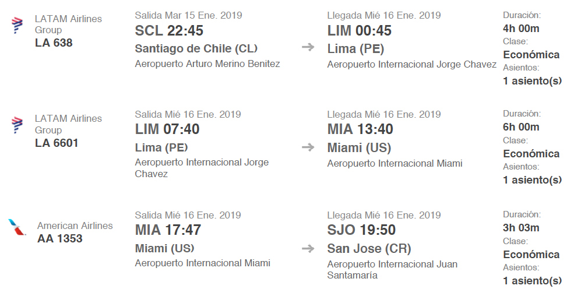
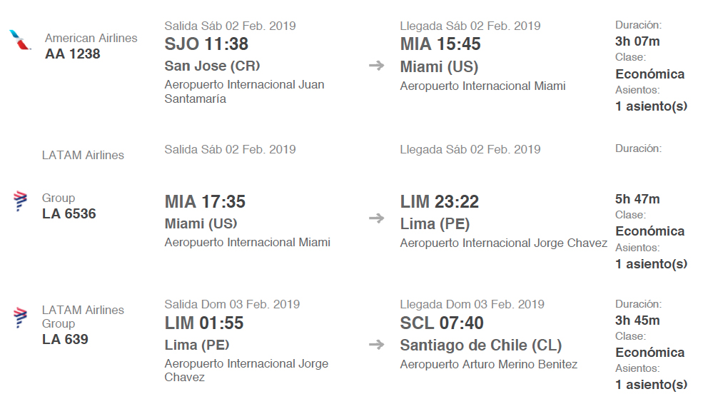

# JMJ Panamá 2019

## Informaciones básicas

* **Fecha:** 15 de Enero al 3 de Febrero
* **Precio:** 1750 USD aproximadamente todo incluído
  * 700-900 USD aproximadamente
  * 850 USD = Ignis + JMJ + Paseo
* **Edad mínima para participar:** Pioneros \(a partir de 8º Básico\)

| **Programa** | **Fecha** |
| --- | --- |
| Viaje de ida — Santiago - San José, Costa Rica | 15 al 16 de Enero |
| Ignis — Encuentro de la JM Internacional | 17 al 20 de Enero |
| JMJ — Encuentro con el Papa Francisco | 21 al 27 de Enero |
| Días de paseo en Costa Rica | 28 al 1 de Febrero |
| Viaje de regreso — San José, Costa Rica - Santiago | 2 al 3 de Febrero |

### Inscripción

* La compra del pasaje es el primer paso para la inscripción. Cada uno debe comprar su propio pasaje.
* Los menores de edad pueden comprar un pasaje donde haya un adulto que viaje. El vuelo recomendado es el vuelo en que viaja el Padre Tiago. En la medida en que tengamos otras opciones de vuelos, serán informadas aquí.

### Vuelo recomendado \(Padre Tiago\)

Este pasaje fue comprado en [despegar.cl](https://www.despegar.cl/vuelos/) a 29 de Junio por el valor aproximado de 900 USD. Talvez ahí sea más fácil de comprar otro asiento en la misma combinación.

#### Ida

#### Regreso

### Contacto para más informaciones

* Padre Tiago Frescata
* _Celular:_ +56 9 3203 6374
* _Email:_ 3campanas@padres-schoenstatt.cl

