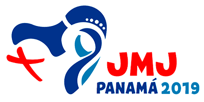

# JMJ Panamá 2019

Informaciones básicas:

* Fecha: 17 de Enero al 3 de Febrero
* Precio: 1800 USD aproximadamente todo incluído

**Nota:** Cada uno debe comprar el pasaje por si mismo \(pronto habrá algunas indicaciones prácticas en ese sentido\)

| Programa | Fecha |
| --- | --- |
| Ignis — Encuentro de la JM Internacional | 18 al 21 de Enero |
| JMJ — Encuentro con el Papa Francisco | 22 al 29 de Enero |
| Días de paseo en Costa Rica | 30 al 2 de Febrero |

