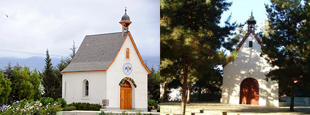

# Peregrinación de Invierno

## Peregrinación Quillota - Los Pinos

* Entre el Santuario de Quillota y el Santuario de Los Pinos \(Reñaca\)
* Viernes 13 a Domingo 15 de Julio de 2018

### Informaciones

* **Salida:** Viernes 13 a las 18h en el Metro Los Dominicos
* **Regreso:** Domingo 15 a las 20h en el Metro Los Dominicos
* **Precio:** $ 10.000 Peregrinación + $ 10.000 Transporte desde Santiago
  * Nadie dejará de participar nunca por motivos económicos!!! Por favor, hablar con el Padre Tiago
* **¡Importante!** Llevar colación para la cena del viernes

### Inscripción

1. **Hasta el miercoles 11 de Julio: Rellene** [**la ficha de inscripción**](http://pentecostes.info/peregrinacion_pioneros_2018-07.pdf) **y firme el respectivo consentimiento.** Envíela digitalizada por email \(donde conste visiblemente la firma del Apoderado\) o por WhatsApp al Padre Tiago \(a quién también podrán entregar en mano la impresión en papel\)
2. **Efectue el pago del monto indicado \(preferencialmente por transferencia bancaria\).** En ese caso deve enviar el comprobante de pago como anexo desde su email \(y no directamente desde el banco\) indicando en el mismo email el nombre del Pionero. _¡Note que los descriptivos enviados directamente por el banco nos obligan, en la mayoría de los casos, a hacer de detectives para llegar al nombre del Pionero!_
3. **La inscripción no está concluída hasta que no reciba un email con la confirmación de la misma.**

### Atención

* **Devoluciones:** Una vez cerradas las inscripciones, no se hará devolución del monto pagado a no ser por una causa grave
* **Email:** 3campanas@padres-schoenstatt.cl
* **WhatsApp:** +56 9 3203 6374 \(Padre Tiago\)



